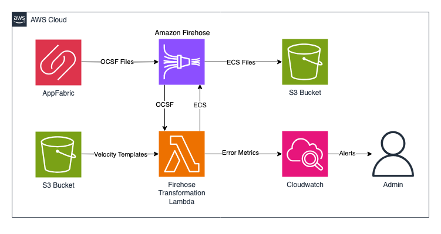

# AWS AppFabric Log Transformer

## What It Is

AWS AppFabric Log Transformer enables you to transform the OCSF schema outputted from [AWS AppFabric](https://aws.amazon.com/appfabric/) into another schema. This solution leverages AWS AppFabric to help aggregate and normalize audit logs from your SaaS application, then transforms the data into ECS (Elastic Common Schema) as a sample.

>**BE AWARE:** This code base is an [Open Source](LICENSE) starter project designed to provide a demonstration and a base to start from for specific use cases. 
It should not be considered fully Production-ready.
If you plan to deploy and use this in a Production environment please review the [Using this in Production](#using-this-in-production) section at the end for some additional guidance.

## Use-case scenario

[AWS AppFabric](https://aws.amazon.com/appfabric/) helps aggregate and normalize audit logs from many SaaS applications into an industry-standard schema format called [OCSF (Open Cybersecurity Schema Framework)](https://docs.aws.amazon.com/appfabric/latest/adminguide/ocsf-schema.html). This solution provides a sample that converts the OCSF schema outputted from AWS AppFabric into another format, ECS (Elastic Common Schema), in real-time. This capability is useful for use-cases like uploading logs to Elasticsearch, which requires ingestion in the ECS format, and still leverage the goodness coming out of AWS AppFabric with aggregation, normalization, and enrichment to the audit logs.

## Solution components

On a high-level, the solution consists of the following components, each contained in a separate folder:

* cdk-stacks - AWS CDK stacks:
    - `cdk-backend-stack` with all the backend resources needed for the solution (AWS Lambda, Amazon API Gateway, Amazon Cognito etc)

### Solution architecture:  

## Solution prerequisites
* AWS Account
* AWS IAM user with Administrator permissions
* Node (v18) and NPM (v8.19) installed and configured on your computer
* AWS CLI (v2) installed and configured on your computer
* AWS CDK (v2) installed and configured on your computer

## Solution setup

The below instructions show how to deploy the solution using AWS CDK CLI.
These instructions assume you have completed all the prerequisites, and you have an existing Amazon Connect instance, SSO/SAML enabled.

1. Clone the solution to your computer (using `git clone`)

2. Check AWS CLI
    - AWS CDK will use AWS CLI local credentials and region. These can be either
      - environment variables (AWS_ACCESS_KEY_ID AWS_SECRET_ACCESS_KEY, AWS_SESSION_TOKEN, AWS_DEFAULT_REGION) set directly in the command line
      - from a [credentials file](https://docs.aws.amazon.com/cli/latest/userguide/cli-configure-files.html), either using the default profile or setting a specific one (i.e. `export AWS_PROFILE=yourProfile`)
    - check your AWS CLI configuration by running any AWS CLI command (e.g. `aws s3 ls`)
    - you can confirm the configured region with  
            `aws ec2 describe-availability-zones --output text --query 'AvailabilityZones[0].[RegionName]'`
    - AWS SDK (used in the configure script in step 4) can use either the environment variables or credentials file/profile config, however note that the region environment variable in this case is AWS_REGION rather than AWS_DEFAULT_REGION (as used in awscli)

3. Install NPM packages
    - Open your Terminal and navigate to `amazon-appfabric-log-transformer/cdk-stacks`
    - Run `npm run install:all`
    - This script goes through all packages of the solution and installs necessary modules (webapp, cdk-stacks, lambdas, lambda-layers)

4. Configure CDK stacks
    - In your terminal,  navigate to `amazon-appfabric-log-transformer/cdk-stacks`
    - Start the configuration script in interactive mode   
      `node configure.js -i`

5. Deploy CDK stacks
    - In your terminal navigate to `amazon-appfabric-log-transformer/cdk-stacks`
    - If you have started with a new environment, please bootstrap CDK: `cdk bootstrap`
    - Run the script: `npm run cdk:deploy`
    - This script deploys CDK stacks
    - Wait for all resources to be provisioned before continuing to the next step
    - AWS CDK output will be provided in your Terminal.

8. Test the solution
    - Go to the AWS AppFabric console and [create an ingestion](https://docs.aws.amazon.com/appfabric/latest/adminguide/getting-started-security.html#getting-started-3-set-up-ingestion) to connect with Amazon Firehose that was created from this solution. (If you don't have app authorization on AWS AppFabric setup yet, refer to [this setup](https://docs.aws.amazon.com/appfabric/latest/adminguide/getting-started-security.html#getting-started-2-authorize-application))
    - Once the above setup is complete, you should see transformed logs being generated to the S3 bucket deployed from the CDK. This process usually takes few mins depending on the SaaS application connected to AWS AppFabric. You can check for any transformation errors published to Cloudwatch metrics namespace 'AppFabricTransformer'.

9. Configure Alarm Actions/Notifications (Optional, but Recommended)
    - The solution will automatically create a metric to track errors while transforming data.  A Cloudwatch alarm has also been configured.  You can optionally setup actions on the alarm to get notifications if there are errors.
    - Make note of the Alarm name that is output by the CDK deployment.  You can also open up the CloudFormation Stack and goto the `Outputs` tab to see the Alarm name.
    - Open the alarm in the CloudWatch console.
    - Configure an Action for the alarm, i.e. [setup an SNS notification](https://docs.aws.amazon.com/AmazonCloudWatch/latest/monitoring/Notify_Users_Alarm_Changes.html) to receive Emails for the Alarm

## Clean up

To remove the solution from your account, please follow these steps:

1. Remove CDK Stacks
    - Run `cdk destroy --all`

2. Remove deployment parameters from AWS System Manager Parameter Store
    - Run `node configure.js -d`

## Using this in Production

It is critical that before you use any of this code in Production that you work with your own internal Security and Governance teams to get the appropriate Code and AppSec reviews for your organization. 

Although the code has been written with best practices in mind, your own company may require different ones, or have additional rules and restrictions.

You take full ownership and responsibility for the code running in your environment, and are free to make whatever changes you need to.

**Some of the things you will want to consider**
- The starter project has extensive logging to CloudWatch, but does not have any monitoring or tracing included, you may want to look at using tools like Cloudwatch Alarms and X-ray.
- The starter project tags all resources with the tags listed in `cdk-stacks/config.params.json` and anything created through the dashboard has the tags in `cdk-stacks/lambdas/constants/Tags.js` added. You may wish to replace them with your own company requirements, or tag at a more granular level.
